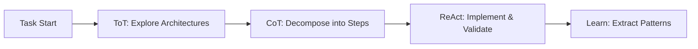

# Future Ideas for Cypher Evolution

This document captures ideas that emerge during development but should be implemented after the core EKP v2 roadmap is complete.

## 1. Proactive Guide Evaluation (2025-01-06)

### Context
While discussing prompt chains and how LLMs can evaluate prompt usefulness without executing them, we realized Claude (the orchestrator) could proactively evaluate which guides are relevant for each task.

### The Idea
Enable the orchestrator to automatically assess guide relevance when starting any task:

```bash
# El orquestador evalúa qué guías son relevantes
"Para esta tarea de refactorización, veo que podrían ser útiles:
- context-guide.md (alta relevancia - necesitamos entender el código actual)
- pattern-extraction.md (media relevancia - podríamos encontrar patrones)
- validation-guide.md (esencial - debemos verificar que no rompemos nada)"
```

### Implementation Strategies

#### 1. Evolution of CLAUDE.md - Add Proactive Evaluation Section
```markdown
## Guide Selection Process

### When Starting Any Task:
1. **First, assess available guides** before diving into execution
2. **Evaluate relevance** based on task keywords and context
3. **Propose a discovery path** to the user

### How to Evaluate Guide Relevance:
```bash
# Mental checklist for each guide
- Does this task involve [guide's domain]?
- Have similar tasks benefited from this guide?
- What specific insights might this guide provide?
```

### Present Your Assessment:
"Based on the task description, I suggest exploring these guides:
- **high relevance**: [guide] because [specific reason]
- **medium relevance**: [guide] might help with [aspect]
- **consider**: [guide] if we encounter [scenario]"
```

#### 2. Create a Meta-Guide: `guide-selection.md`
A guide that teaches the orchestrator HOW to select guides:

```markdown
---
version: 1.0.0
type: meta-guide
---

# Guide Selection Guide

## Evaluation Process
1. Parse Task Intent
2. Map to Available Guides
3. Contextual Relevance Scoring
4. Present as Discovery Path
```

#### 3. Modify Task Execution Flow
Add evaluation as explicit step:

```markdown
### Task Execution Flow
# 1. Understand the task
# 2. EVALUATE GUIDE RELEVANCE (NEW!)
# 3. Build context through selected guides
# 4. Create focused prompts and delegate
```

#### 4. Pattern Discovery Through Usage
Document patterns as they emerge:

```markdown
# cypher/patterns/guide-selection-patterns.md

### For Refactoring Tasks
- Always: context-guide (understand current state)
- Always: validation-guide (ensure nothing breaks)
- Often: pattern-extraction-guide (find reusable solutions)
```

#### 5. Simple Prompt Trigger
Add reminder at the end of task display:

```bash
---
💡 Tip: Consider which guides might help with this task before starting.
```

### Key Insight
This creates a natural dialogue flow where guide selection becomes part of the conversation, not an automated process. It maintains our principle of "organic over systematic" while providing real value.

### When to Implement
After Phase 2 of the roadmap (when core guides exist), before Phase 3 (migration).

---

## 2. Context as Living Memory - JSON Alternative (2025-01-06)

### Context
From prompt chains methodology: using `chain_context.json` for clean, compact context.

### Our Adaptation
Instead of rigid JSON, use narrative markdown that any LLM can read:

```markdown
# cypher/cdd/<task-id>/dialogue.md

## Context Discovery
- Found: Authentication uses JWT pattern
- Found: Similar implementation in task-45
- Decision: Reuse token validation logic

## Pattern Recognition  
- Identified: Middleware pattern for auth
- Anti-pattern: Don't duplicate validation
```

### Benefits
- More organic than JSON
- Easier to read/write for humans
- Still structured enough for LLMs
- Fits our "dialogue as process" principle

### When to Implement
Can be adopted immediately as tasks are executed.

---

## 3. Guide Composition Patterns (2025-01-06)

### Context
The idea of dynamic prompt chains based on the problem.

### Implementation
Allow guides to reference and compose with other guides:

```markdown
# In context-guide.md
---
composes-with:
  - pattern-guide: "When patterns are found"
  - validation-guide: "To verify context completeness"
---
```

### Benefits
- Guides become modular and composable
- Natural flow between guides
- Knowledge reuse without duplication

### When to Implement
After core guides are stable and patterns of usage emerge.

---

## 4. Evolution by Natural Mutation (2025-01-06)

### Context
From prompt chains discussion: AI creativity generates "related but mutated" prompts, then evaluates which make sense.

### The Idea
Guides evolve through documented mutations based on what works:

```markdown
# In header of any guide
---
version: 1.2.0
mutations:
  - from: "search all files"
  - to: "search by relevance patterns"
  - learned: "task-89 showed focused search is 10x faster"
  - impact: "Reduced context generation time by 80%"
---
```

### Implementation
1. Track what changes between guide versions
2. Document WHY the change was made
3. Measure impact when possible
4. Let unsuccessful mutations die naturally

### When to Implement
After guides have been used in 10+ tasks and patterns emerge.

---

## 5. Commands Suggest Discovery Paths (2025-01-06)

### Context
Natural evolution from guide evaluation - commands could suggest entire exploration paths.

### The Idea
```bash
cypher plan task-123

# Output suggests a journey:
"Para esta tarea de migración de base de datos, sugiero este camino:
1. context → entender esquema actual
2. patterns → buscar migraciones previas  
3. risks → identificar posibles problemas
4. validate → crear plan de rollback

¿Este camino tiene sentido para ti?"
```

### Implementation
- Commands analyze task type
- Suggest relevant guide sequences
- User can modify or accept
- Learn from choices over time

### When to Implement
After guide selection patterns are documented.

---

## 6. Project-Specific Knowledge via Imports (2025-01-06)

### Context
CLAUDE.md supports imports. We can use this for project-specific patterns without contaminating the main file.

### The Idea
```markdown
# In project's CLAUDE.md
@~/.claude/react-patterns.md      # Personal React preferences
@~/.claude/testing-strategy.md    # How I like to test
@./docs/team-conventions.md       # Team agreements
```

### Benefits
- Separation of concerns
- Easy sharing of patterns
- Personal vs team knowledge
- No git conflicts on personal preferences

### When to Implement
Immediately useful, minimal implementation needed.

---

## 7. Guide Effectiveness Metadata (2025-01-06)

### Context
Track which guides actually help vs add noise.

### The Idea
```yaml
---
effectiveness: 0.85    # Based on user feedback
usage-count: 47        # Times consulted
last-critical: task-89 # When it was essential
evolution-rate: high   # How often it changes
common-pairs: [validation-guide, pattern-guide]
---
```

### Implementation
- Start simple: just count usage
- Add feedback mechanism later
- Use data to suggest guide retirement
- Identify guide combinations that work

### When to Implement
Phase 5 optimization, needs metrics system.

---

## 8. Commands as Questions (2025-01-06)

### Context
Ultimate evolution: commands don't instruct, they inquire.

### The Idea
Instead of imperative commands, use socratic method:

```bash
cypher context task-123

# Instead of: "Execute these searches"
# Asks: "What existing patterns might inform this task?"
# Then: "Have we solved similar problems before?"
# Then: "What constraints should we consider?"
```

### Benefits
- More natural dialogue
- Encourages thinking
- Reduces mechanical following
- True learning through discovery

### When to Implement
Future evolution after commands as teachers proves successful.

---

## Implementation Plan

### Phase A: Immediate Adoptions (During Roadmap)
1. **Context as Living Memory** - Start using narrative markdown now
2. **Project Imports** - Document pattern for teams

### Phase B: Post-Roadmap Quick Wins (Week 1-2 after)
1. **Proactive Guide Evaluation** - Update CLAUDE.md
2. **Guide Selection Patterns** - Document as discovered
3. **Discovery Path Suggestions** - Natural extension

### Phase C: Learning System (Month 1-2)
1. **Evolution Mutations** - Track guide changes
2. **Effectiveness Metadata** - Simple metrics first
3. **Composition Patterns** - Let emerge from use

### Phase D: Philosophical Evolution (Month 3+)
1. **Commands as Questions** - When ready for paradigm shift
2. **Full socratic dialogue** - Ultimate goal

### Guiding Principles for Implementation
- Start simple, evolve naturally
- Let patterns emerge before systematizing
- Prefer convention over configuration
- Every feature should teach something
- If it feels like over-engineering, it probably is

---

## 9. From EUREKA Documents: Architectural Insights (2025-01-08)

### Context
During deep analysis of EUREKA3.txt and EUREKA4.txt - conversations that documented Cypher's conceptual evolution - we discovered several profound insights and architectural patterns that weren't fully captured in the current technical roadmap. These documents represent the "conceptual archaeology" of the framework.

### Key Historical Insights

**The Anti-Pattern We Escaped**: The original "Execution Payload" paradigm created self-contained directories with master plans, monolithic contexts, and orchestration scripts. This failed because:
- It isolated knowledge in temporary containers
- It was brittle and couldn't adapt to emerging information
- "We were building a sophisticated assembly line, but what we needed was a garden"

**The Double Revelation**:
1. Knowledge should live permanently within the domain it describes (→ CLAUDE.md files)
2. The dialogue IS the framework, not a process the framework manages

### 9.1 Explicit Mapping of Commands to Cognitive Architectures

**The Insight**: Commands already implicitly implement CoT/ToT/ReAct patterns. Making this explicit would enhance understanding and usage.

**Implementation Ideas**:
```markdown
# In each guide header
---
cognitive-architecture: ToT  # or CoT, ReAct
reasoning-mode: exploratory  # or sequential, iterative
---
```

**Command Mappings**:
- `cypher plan`, `cypher expand` → CoT (linear decomposition)
- `cypher research --perspectives` → ToT (exploring branches)
- `cypher verify` (new) → ReAct (action-observation loops)

### 9.2 The `cypher verify` Command - ReAct Loop Implementation

**Context**: EUREKA3 identified that Cypher provides tools for agents to operate in ReAct mode but lacks explicit validation loops.

**The Idea**:
```bash
cypher verify <task-id>
# Automated quality gate that:
# 1. Reads task outputs: ["src/auth.ts", "tests/auth.test.ts"]
# 2. Runs validation suite: lint, format, tests
# 3. Returns structured report for agent self-correction
# 4. Enables true ReAct loops for implementation agents
```

**Benefits**:
- Closes the observation loop in ReAct
- Enables autonomous error correction
- Provides concrete "observations" for agents

### 9.3 Architectural Decision Records via ToT

**Context**: The `research` command already implements ToT but doesn't persist the decision tree.

**The Idea**:
```bash
cypher research "database choice" --perspectives=performance,scalability,cost
# Generates: cypher/cdd/<task-id>/research-tree.md
# Permanent record of:
# - Each perspective explored (branches)
# - Synthesis and recommendation
# - Rationale for final decision
```

**Future Evolution**: These could become searchable: "What past decisions relate to caching?"

### 9.4 Context Patches System

**Context**: EUREKA4 introduced the concept of context evolution through "patches" - incremental updates to knowledge.

**The Idea**:
```markdown
# In any CLAUDE.md
@patch 2025-01-08-auth-jwt
+ JWT validation now uses rotating secrets
+ Added refresh token pattern
- Removed session-based auth
```

**Implementation**:
```bash
cypher patch src "New JWT pattern discovered in task-89"
# Automatically creates timestamped patch in /src/CLAUDE.md
# Patches are reviewable, revertible, and traceable
```

### 9.5 Evolution Metrics System

**Context**: From EUREKA documents - "The system's goal is to learn, not just complete tasks"

**The Idea**:
```json
// cypher/knowledge/evolution-metrics.json
{
  "archetypes": {
    "planning-guide.md": {
      "version": "1.3.0",
      "mutations": 12,
      "effectiveness": 0.94,
      "last-evolution": "task-89"
    }
  },
  "knowledge-growth": {
    "patterns-extracted": 47,
    "context-patches": 23,
    "guide-evolutions": 15
  },
  "learning-velocity": 0.3  // learnings per task
}
```

**Uses**:
- Track which guides are most effective
- Identify stagnant knowledge areas
- Measure system intelligence growth

### 9.6 The Hybrid Lifecycle Model

**Context**: EUREKA3 proposed a complete task lifecycle using all three cognitive architectures.

**The Model**:


**Implementation**: Could become a meta-guide showing when to use each architecture.

### 9.7 Protocolo Cognitivo Cypher (PCC)

**Context**: EUREKA4's revelation that Cypher isn't a task framework but a "dialogue protocol"

**The Insight**: Document Cypher as a protocol specification:
- Dialogue formats and conventions
- Knowledge persistence rules
- Evolution mechanisms
- Inter-agent communication patterns

**Benefit**: Allows others to implement Cypher-compatible tools/agents

### Key Philosophical Insights to Preserve

1. **"The Dialogue IS the Framework"**: Not metaphorical. The conversation between Supervisor and Orchestrator literally creates the framework in real-time.

2. **"From Assembly Line to Garden"**: Development is cultivation, not manufacturing. Commands are gardeners.

3. **"Teach the Craftsman, Don't Create Disposable Tools"**: Every interaction should increase system wisdom.

### Implementation Priorities

**Phase A (During Roadmap)**:
- Document cognitive architecture mappings in guides
- Start collecting decision trees from research commands

**Phase B (Quick Wins Post-Roadmap)**:
- Implement `cypher verify` command
- Add evolution metrics tracking
- Create first context patches

**Phase C (System Evolution)**:
- Full PCC documentation
- Searchable decision history
- Automated pattern extraction

### Why This Matters

These aren't just features - they represent the crystallization of hard-won insights from Cypher's evolution. The EUREKA documents show us not just where we are, but why we're here and what paths we consciously rejected. By preserving this conceptual archaeology, we ensure future development stays true to the core philosophy while continuing to evolve.

---

## How to Use This Document

1. **During Development**: When ideas emerge that are valuable but not immediately needed, document them here
2. **After Roadmap**: Review this document for next phase features
3. **Pattern Recognition**: Look for recurring themes across ideas
4. **Evolution**: Update ideas as understanding deepens

Remember: These are seeds for future growth, not immediate requirements. The best features will emerge from actual use, not planned design.