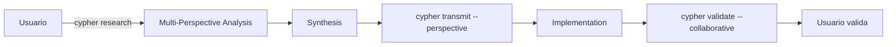

# COLLABORATION_PLAN: Estrategia de Colaboración AI en Cypher

## Visión

Cypher evoluciona de "AI-First" a "AI-Collaborative-First", permitiendo que múltiples perspectivas de IA trabajen juntas para generar mejores resultados, todo mientras mantiene la simplicidad como principio fundamental.

## Principios de Colaboración

1. **Un Comando, Múltiples Perspectivas**: Extender comandos existentes, no crear nuevos
2. **Simplicidad sobre Arquitectura**: Sin clases de agentes, sin explosión de templates
3. **Valor Incremental**: Cada feature es útil por sí sola
4. **Human-in-the-Loop**: El usuario siempre orquesta y valida

## Plan de Implementación

### 🎯 Corto Plazo (Phase 2-3): Foundations

#### 1. Flag `--perspective` en Comandos Existentes

```bash
# Ejemplos de uso
cypher transmit 1.2 --perspective=architecture
cypher transmit 1.2 --perspective=security
cypher validate --perspective=performance
```

**Implementación**: ~10 líneas por comando
```typescript
.option('--perspective <type>', 'Analysis perspective', 'implementation')
```

#### 2. Documentación en Templates

Actualizar `PREFLIGHT_TEMPLATE.md`:
```handlebars
{{#if perspective}}
## PERSPECTIVE: {{perspective}}
This context is optimized for {{perspective}} considerations.
{{/if}}
```

#### 3. Extensión Mínima de Interfaces

```typescript
interface Task {
  // ... campos existentes
  collaboration?: {
    perspectives?: string[];
    synthesizedAt?: string;
    consensusPoints?: string[];
  };
}
```

### 🚀 Medio Plazo (Phase 5-6): Power Features

#### 1. Comando `cypher research`

El comando estrella para investigación colaborativa:

```bash
# Investigación simple
cypher research "How to implement JWT"

# Multi-perspectiva
cypher research "OAuth2 vs JWT" --perspectives=security,performance

# Para tarea específica
cypher research --task=1.2 "Best auth practices"
```

**Output Estructurado**:
```markdown
# RESEARCH: [Topic]

## [Perspective 1]
- Key findings...

## [Perspective 2]
- Key findings...

## SYNTHESIS
- Consensus: Points of agreement
- Trade-offs: Different viewpoints
- Recommendation: Actionable conclusion
```

#### 2. Provider Method Minimalista

```typescript
interface AIProvider {
  collaborativeAnalysis(
    prompt: string,
    perspectives: string[]
  ): Promise<{
    analyses: Record<string, string>;
    synthesis: string;
  }>;
}
```

#### 3. Utilidad de Síntesis

```typescript
// utils/synthesize.ts (~50 líneas)
export function synthesizePerspectives(
  analyses: Record<string, string>
): string {
  // 1. Identificar puntos comunes
  // 2. Identificar divergencias
  // 3. Generar recomendación
  // 4. Formatear en Markdown
}
```

## Flujo de Trabajo Colaborativo



## Métricas de Éxito

- **Simplicidad**: < 500 líneas nuevas de código total
- **Reutilización**: 0 comandos duplicados
- **Composabilidad**: Todas las features funcionan independientemente
- **Valor**: Cada fase entrega mejoras tangibles

## Anti-Patrones a Evitar

❌ **NO HACER**:
- Crear clases Agent separadas
- Añadir comandos para cada interacción
- Multiplicar templates
- Sobre-diseñar la arquitectura

✅ **SÍ HACER**:
- Extender comandos existentes
- Reutilizar templates
- Mantener interfaces simples
- Evolucionar incrementalmente

## Ejemplo Práctico

### Desarrollo de Feature de Autenticación

```bash
# 1. Research
cypher research --task=1.2 "JWT vs Session auth"

# 2. Contexto especializado
cypher transmit 1.2 --perspective=security

# 3. Implementación informada
# (El desarrollador/AI implementa con toda la información)

# 4. Validación colaborativa
cypher validate --collaborative

# 5. Update con síntesis
cypher update 1.2 --status=done --collaboration="security,performance"
```

## Evolución Futura

1. **Perspectives Especializadas**: domain-specific perspectives
2. **Aprendizaje**: Patrones exitosos de colaboración
3. **Asincronía**: Colaboración no-bloqueante entre agentes
4. **Métricas**: Tracking de qué combinaciones dan mejores resultados

## Conclusión

Este plan transforma Cypher de una herramienta AI-powered a una plataforma de orquestación colaborativa, manteniendo siempre la simplicidad como estrella guía.

> "La mejor arquitectura es la que no necesitas explicar"